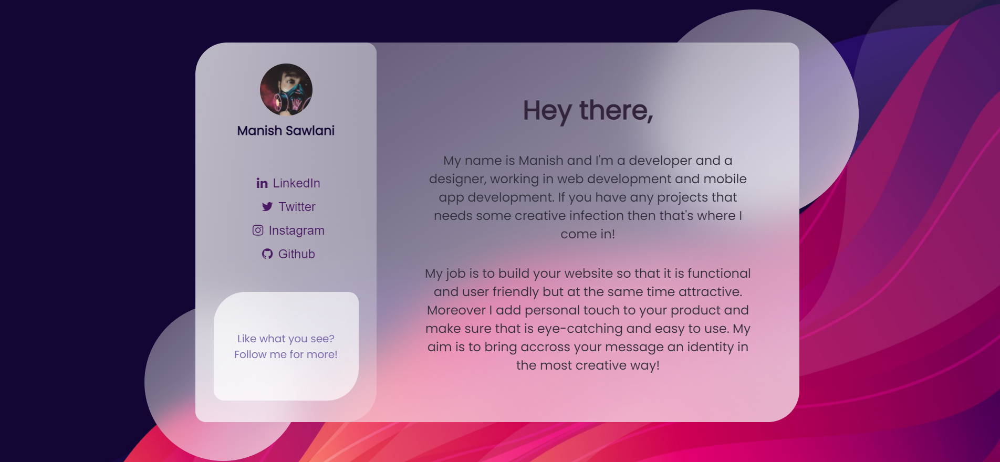

# Profile-Card-CSS

## A sample profile template made using vanilla CSS3 and a little bit of javascript.

### What does it cover?

Glassmorphism UI 
MediaQueries 
Animations 
Responsiveness

### How does it look?

  

